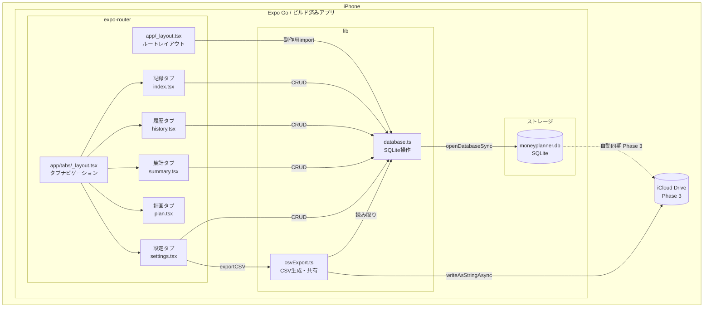
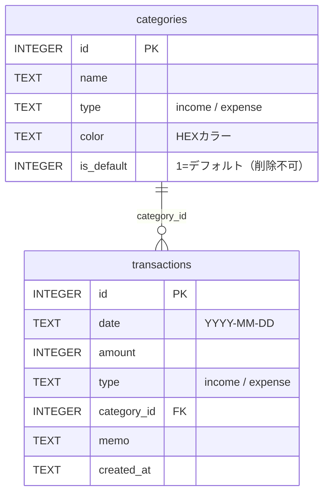
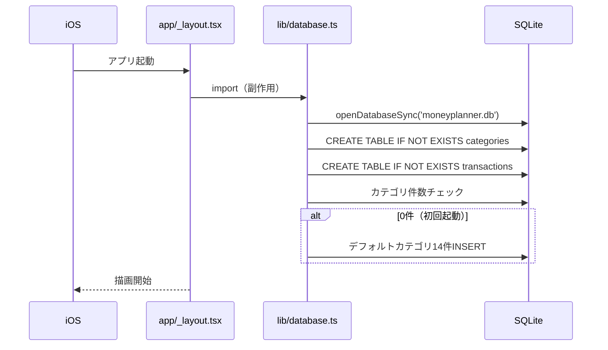
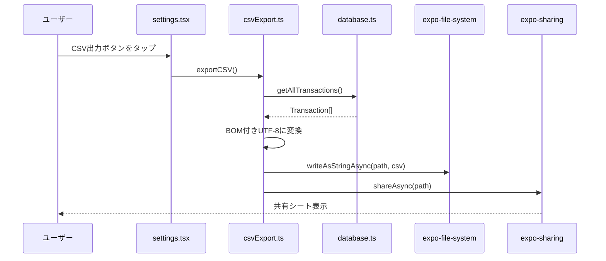
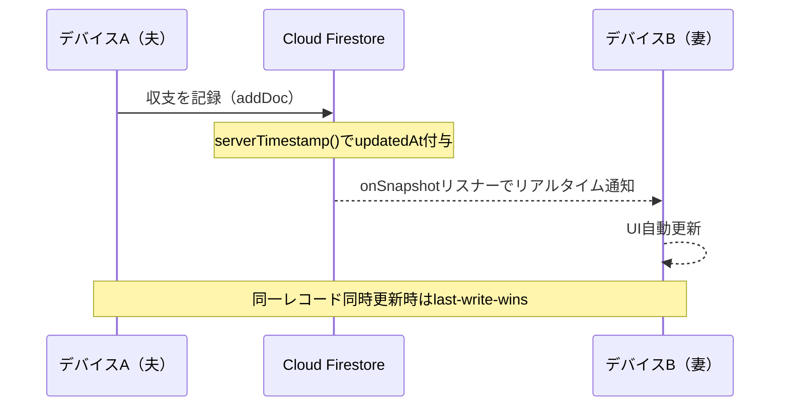

# moneyplanner — アーキテクチャ概要

## 全体構成



---

## 画面構成（5タブ）


| タブ | ファイル                  | 主な機能                                 |
| ---- | ------------------------- | ---------------------------------------- |
| 記録 | `app/(tabs)/index.tsx`    | 収支入力フォーム・カテゴリ選択・日付入力 |
| 履歴 | `app/(tabs)/history.tsx`  | リスト表示・カレンダービュー             |
| 集計 | `app/(tabs)/summary.tsx`  | 月次・年次・カテゴリ別集計               |
| 計画 | `app/(tabs)/plan.tsx`     | ライフプラン（Phase 2）                  |
| 設定 | `app/(tabs)/settings.tsx` | カテゴリ管理・CSV出力                    |

---

## データベース設計



### デフォルトカテゴリ

| 種別 | カテゴリ                                                                                 |
| ---- | ---------------------------------------------------------------------------------------- |
| 収入 | 給与・副業・その他収入                                                                   |
| 支出 | 食費・住居費・光熱費・通信費・交通費・医療費・娯楽費・衣服費・教育費・保険料・その他支出 |

---

## DB初期化フロー



> **重要**: `initDatabase()` はモジュールロード時に自動実行される。`useEffect`内で呼ばない（タイミング競合の原因）。

---

## CSV出力フロー



---

## Phase 3: Firebase同期（計画中）



- **同期方式**: Cloud Firestoreリアルタイムリスナー（`onSnapshot`）
- **オフライン**: Firestore内蔵のオフライン永続化で自動対応
- **認証**: Apple Sign-In + Firebase Auth
- **世帯共有**: 招待コード方式、6桁コードで家族が同一世帯に参加
- **競合解決**: `serverTimestamp()` による last-write-wins
- **実装要件**: expo-dev-client + React Native Firebase + EAS Build

---

## ファイルツリー

```
moneyplanner/
├── app/
│   ├── _layout.tsx          # ルートレイアウト・DB import
│   ├── +not-found.tsx
│   └── (tabs)/
│       ├── _layout.tsx      # タブ定義
│       ├── index.tsx        # 記録
│       ├── history.tsx      # 履歴
│       ├── summary.tsx      # 集計
│       ├── plan.tsx         # 計画
│       └── settings.tsx     # 設定
├── lib/
│   ├── database.ts          # SQLite操作・型定義
│   └── csvExport.ts         # CSV生成・共有
├── components/
│   ├── HapticTab.tsx
│   ├── ThemedText.tsx
│   ├── ThemedView.tsx
│   └── ui/
│       ├── IconSymbol.tsx
│       ├── IconSymbol.ios.tsx
│       ├── TabBarBackground.tsx
│       └── TabBarBackground.ios.tsx
├── constants/
│   └── Colors.ts
├── hooks/
│   ├── useColorScheme.ts
│   └── useThemeColor.ts
├── assets/
│   ├── fonts/SpaceMono-Regular.ttf
│   └── images/（アイコン類）
├── CLAUDE.md                # 開発ガイドライン
├── PLAN.md                  # 開発ロードマップ
└── ARCHITECTURE.md          # このファイル
```

---

## 技術スタック

| 用途           | パッケージ                             | バージョン                        |
| -------------- | -------------------------------------- | --------------------------------- |
| フレームワーク | Expo                                   | ~54.0.0                           |
| UI             | React Native                           | 0.81.5                            |
| ルーティング   | expo-router                            | ~6.0.23                           |
| DB             | Cloud Firestore                        | Phase 3で移行                     |
| 認証           | Apple Sign-In + Firebase Auth          | Phase 3で追加                     |
| Firebase       | @react-native-firebase/\*              | Phase 3で追加                     |
| ~~旧DB~~       | ~~expo-sqlite~~                        | ~~~16.0.10~~（Phase 3で削除予定） |
| CSV出力        | expo-file-system/legacy                | ~19.0.21                          |
| 共有           | expo-sharing                           | ~14.0.8                           |
| 日付入力       | @react-native-community/datetimepicker | 8.4.4                             |
| アニメーション | react-native-reanimated                | ~4.1.1                            |
